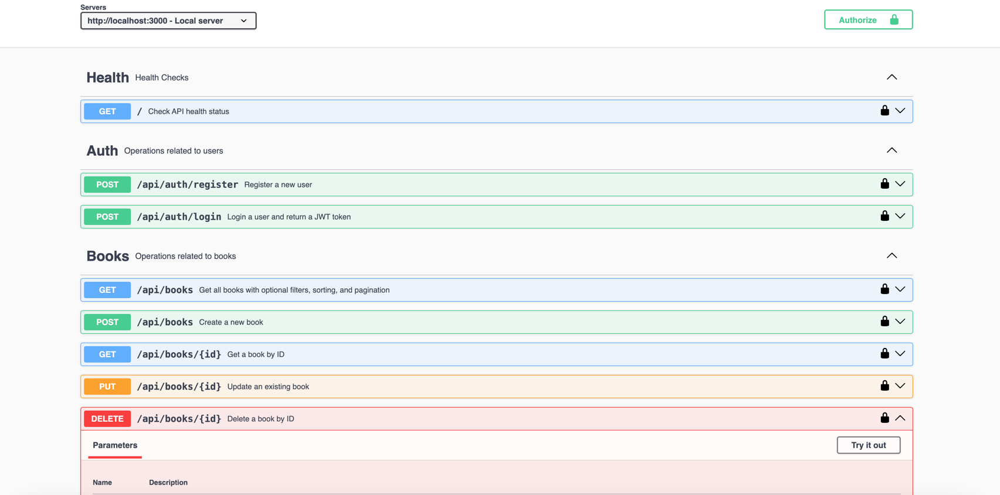

# fpbooks

- [Introduction](#introduction)
- [Main Features](#main-features)
- [Project Structure](#project-structure)
- [Tech Stack](#tech-stack)
- [Getting started](#getting-started)
   * [Pre-requisite](#pre-requisite)
   * [Commands](#commands)
   * [Connect to deployed app](#connect-to-deployed-app)
- [Development mode](#development-mode)
   * [Pre-requisites](#pre-requisites)
   * [Project setup](#project-setup)
   * [Before starting the app for the first time](#before-starting-the-app-for-the-first-time)
   * [Starting the app in dev](#starting-the-app-in-dev)
- [Tests](#tests)
   * [First time running the tests](#first-time-running-the-tests)
- [Github pipeline](#github-pipeline)

## Introduction

Book Management API - one App to read them all

## Main Features

- [User management and Authorization](src/services/userService.ts)
- [Full GitHub pipeline with build, unit tests, docker deploy, integration tests for deployment readiness](.github/workflows/workflow-main.yml)
- [Rate limiting to limit API calls](src/middlewares/rateLimiter.ts)
- [Centralized Error Handling](src/middlewares/errorHandler.ts)
- [Centralized Validators](src/middlewares/bookValidator.ts)
- [Advanced search with pagination, filtering and sorting](src/services/bookService.ts)
- [Mysql Routine generateData.sql to populate Books table](script/generateData.sql)
- Separate environments for test, development and production(separate env files)
- [Swagger docs](src/config/swagger.ts)


## Project Structure

```text
src/
 ├── controllers/     # API Controllers
 ├── routes/          # API Routes
 ├── services/        # Business Logic
 ├── models/          # Database Models
 ├── middlewares/     # Auth, Logging
 ├── config/          # Configuration
 ├── tests/           # Unit & Integration Tests
 ├── app.ts           # Express App
 ├── server.ts        # Server Entry
 ├── utils.ts         # Utilities
```
DB diagram in [docs](docs/db_digram.png)

## Tech Stack

```text
Language:  TypeScript
Framework: Express.js
Database: MySQL
ORM: Drizzle ORM
Validation: Express-validator
Logging: Winston
Testing: Jest + Supertest
Authentication: JWT
Containerization: Docker
```

## Getting started

### Pre-requisite
Docker installed

Create a `.env.production` file in the root of the project.
This file contains sensitive information, please contact fpetrungaro (the author).

```text
NODE_ENV=production
DB_HOST=database
DB_USER=root
DB_PASSWORD=<MY_PASSWORD>
DB_NAME=fp_books_db
DB_PORT=3306
JWT_SECRET=<MY_SECRET>
LOG_LEVEL=info
```

### Commands

```shell
docker-compose down -v
docker compose --env-file .env.production up --build -d
```

### Connect to deployed app
Use 3001 port

```text
http://localhost:3001
```

Swagger documentation available at
```http request
http://localhost:3001/api-docs
```


- Register a user and login in order to generate a JT token (Auth APIs)
- Save it to swagger and test the Books API

## Development mode

### Pre-requisites

Node and NPM installed

### Project setup

Install the dependencies
```shell
npm install
```

### Before starting the app for the first time

Create Mysql database, e.g.
```sql
CREATE DATABASE fp_books_db;
```
Create `.env.development` and `.env.test` files in the root of the project.
Those files contain sensitive information, please contact fpetrungaro (the author).

`.env.development`
```text
NODE_ENV=development
DB_HOST=localhost
DB_USER=root
DB_PASSWORD=<MY_PASSWORD>
DB_NAME=fp_books_db
DB_PORT=3306
JWT_SECRET=<MY_SECRET>
```
`.env.test`
```text
NODE_ENV=test
DB_HOST=localhost
DB_USER=root
DB_PASSWORD=<MY_PASSWORD>
DB_NAME=test_fp_books_db
DB_PORT=3306
JWT_SECRET=<MY_SECRET>
LOG_LEVEL=silly
```

Please note: the root user password of mysql user must be the same of the one specified in those files

Run migrations

```shell
npm run migration:development
```

### Starting the app in dev

```shell
npm run dev
```

Connect to

```http request
http://localhost:3000/
```

Swagger documentation available at
```http request
http://localhost:3000/api-docs
```


## Tests

### First time running the tests
First time before running the test:

Create Mysql database, e.g.
```sql
CREATE DATABASE test_fp_books_db;
```

```sh
NODE_ENV=test drizzle-kit generate && NODE_ENV=test drizzle-kit migrate
```


Run integration + unit test
```shell
npm test
```

Run unit test
```shell
npm test:unit
```

Run integration test
```shell
npm test:integration
```

## Github pipeline
Available at
https://github.com/fpetrungaro/fpbooks/actions/workflows/workflow-main.yml

Can be manually run (Main workflow)


